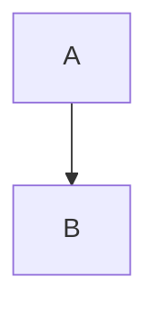

# Obsidian 详细语法指南

Obsidian 是一款基于 Markdown 的强大笔记工具，它不仅支持标准 Markdown 语法，还扩展了许多特有功能。以下是 Obsidian 的详细语法指南：

## 基础 Markdown 语法

### 1. 标题
```markdown
# 一级标题
## 二级标题
### 三级标题
#### 四级标题
##### 五级标题
###### 六级标题
```
标题层级对后续的目录生成和检索都很重要

### 2. 段落与换行
- 段落间用空行分隔
- 行内换行：行尾加两个空格再回车
- 启用 StrictLineBreaks 后换行行为会有变化

### 3. 文本样式
```markdown
*斜体* 或 _斜体_
**粗体** 或 __粗体__
***粗斜体*** 或 ___粗斜体__
~~删除线~~
==高亮==
`行内代码`
```

### 4. 列表
#### 无序列表
```markdown
- 项目1
- 项目2
  - 子项目
```

#### 有序列表
```markdown
1. 第一项
2. 第二项
   3. 子项
```

#### 任务列表
```markdown
- [x] 已完成
- [ ] 未完成
```

### 5. 链接与图片
```markdown
[文本](URL)  # 外部链接
  # 图片
```

## Obsidian 特有语法

### 1. 内部链接
Obsidian 支持两种内部链接格式：
```markdown
[[笔记名]]  # 维基链接
[文本](笔记名.md)  # Markdown链接
```
链接可以指向特定标题：`[[笔记名#标题]]`

### 2. 标签
```markdown
#标签名  # 简单标签
#父标签/子标签  # 嵌套标签
```
标签中不允许使用空格，可用驼峰式、下划线或连字符分隔

### 3. 内容引用
```markdown
![[笔记名]]  # 嵌入整个笔记
![[笔记名#标题]]  # 嵌入特定标题内容
![[笔记名^段落]]  # 嵌入特定段落
```

### 4. 自定义图片大小
```markdown
  # 指定宽高
  # 仅指定宽度
![[图片.png|200]]  # 本地图片
```

### 5. Callout 提示框
```markdown
> [!note] 标题
> 提示内容
```
支持的样式包括：note、tip、warning、danger等

### 6. 注释
```markdown
%%这是注释%%
<!-- 这也是注释 -->
```
注释仅在编辑模式下可见

## 高级功能

### 1. 双向链接
Obsidian 的核心功能，通过`[[ ]]`创建链接，即使目标笔记不存在也可先创建链接

### 2. MOC (内容地图)
用于组织笔记的索引页，比传统文件夹分类更灵活

### 3. 图表支持
使用 Mermaid 语法创建图表：
````markdown

````

### 4. 模板系统
可以创建标准笔记模板，包含元数据如创建日期、标签等

## 实用技巧

1. **命名规范**：使用清晰具体的笔记名，避免重名
2. **文件夹结构**：按文件类型而非内容分类
3. **插件推荐**：
   - Dataview：数据化管理笔记
   - Calendar：日记管理
   - Mind Map：思维导图
4. **工作流程**：
   - 快速捕获想法
   - 定期整理笔记
   - 建立知识链接

## 注意事项

1. 同步时注意网络环境，推荐使用iCloud或OneDrive
2. 控制单个笔记大小以提高性能
3. 移动端使用官方App并设置快捷输入

Obsidian 的强大之处在于它的灵活性和可扩展性，建议根据个人需求逐步探索更多高级功能。